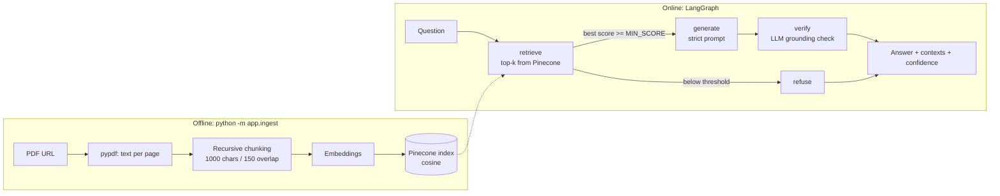

# Agentic AI eBook — RAG Chatbot (LangGraph + Pinecone)

A retrieval-augmented chatbot that answers **only** from the
[Agentic AI eBook](https://konverge.ai/pdf/Ebook-Agentic-AI.pdf). Each response contains the final answer,
the retrieved context chunks (page + similarity score) and a confidence score.

**Stack:** Python 3.10+, LangGraph, Pinecone (serverless), FastAPI, optional Streamlit UI.
Models are configurable via `.env`:

| Setup | Embeddings | LLM | Cost |
|-------|-----------|-----|------|
| **A. Groq + local (tested)** | `sentence-transformers/all-MiniLM-L6-v2` (384-dim, runs locally) | Groq `openai/gpt-oss-120b` | Free tiers (rate-limited) |
| **B. OpenAI** | `text-embedding-3-small` (1536-dim) | `gpt-4o-mini` | Paid API |

Setup A was the one run end to end while building this. Setup B is implemented but was not exercised.

## Architecture



**Ingestion.** The PDF is downloaded, text is extracted per page (`pypdf`), whitespace is normalised, and pages are
split with a recursive splitter (1000 chars, 150 overlap). Fragments under 150 characters (headings, page numbers) are dropped.
Each chunk is embedded and upserted with metadata `{text, page, source}`; chunk IDs are `p<page>-c<n>`, so re-ingesting overwrites.

**Query graph (LangGraph).** State flows through `retrieve → generate → verify`, with a conditional edge to `refuse`.

**Three layers keep answers grounded:**
1. **Retrieval gate** — if the best chunk's cosine score is below `MIN_SCORE`, the LLM is never called and the bot refuses.
2. **Constrained generation** — temperature 0; the prompt limits the model to the numbered excerpts, requires `[n]` citations,
   and prescribes a fixed refusal sentence when the answer isn't in them.
3. **Verification node** — a second LLM pass checks that every claim in the draft is supported by the retrieved context.
   Unsupported drafts are replaced by the refusal (`grounded: false`).

**Confidence score.** The mean cosine similarity of the top-3 chunks, linearly rescaled (0.2 → 0, 0.7 → 1) and clamped to
[0, 1]; halved if the grounding check fails. This is a *heuristic relevance signal*, not a calibrated probability.
With the local MiniLM embeddings, good matches often score ~0.8 and the value saturates at 1.0, so use `retrieval_score`
and the per-chunk `score` values for finer comparison, or adjust `_calibrate()` in `app/rag_graph.py`.

## Project layout

| Path | Purpose |
|------|---------|
| `app/config.py` | Settings loaded from `.env` |
| `app/models.py` | Embedding / LLM factories (OpenAI, Hugging Face, Groq) |
| `app/ingest.py` | Download → extract → chunk → embed → upsert |
| `app/rag_graph.py` | LangGraph pipeline (retrieve / generate / verify / refuse) |
| `app/api.py` | FastAPI: `POST /chat`, `GET /health` |
| `ui.py` | Optional Streamlit chat UI |
| `scripts/run_samples.py` | Runs the sample queries, writes `docs/sample_outputs.md` |
| `docs/sample_queries.md` | The six sample queries |

## Setup

Requires Python 3.10+ and a [Pinecone](https://www.pinecone.io) API key, plus a Groq key (setup A) or OpenAI key (setup B).

**Windows (Command Prompt)**
```bat
py -3.13 -m venv .venv
.venv\Scripts\activate
python -m pip install --upgrade pip
python -m pip install -r requirements.txt
python -m pip install -r requirements-groq.txt      :: setup A only (downloads PyTorch, large)
copy .env.example .env
notepad .env
```

**macOS / Linux**
```bash
python3 -m venv .venv && source .venv/bin/activate
python -m pip install -r requirements.txt
python -m pip install -r requirements-groq.txt      # setup A only
cp .env.example .env
```

### Configure `.env`

**Setup A (Groq + local embeddings):**
```
GROQ_API_KEY=gsk_...
PINECONE_API_KEY=pcsk_...
EMBEDDING_PROVIDER=huggingface
LLM_PROVIDER=groq
LLM_MODEL=openai/gpt-oss-120b
PINECONE_INDEX=agentic-ai-ebook-384
```
**Setup B (OpenAI):**
```
OPENAI_API_KEY=sk-...
PINECONE_API_KEY=pcsk_...
```
No quotes or spaces around `=`. Do not set `EMBEDDING_MODEL`, `EMBEDDING_DIM` or `LLM_MODEL` to OpenAI names when using setup A.
The index name should encode the embedding size, because an index is fixed to one dimension (384 vs 1536);
ingestion stops with a clear message on a mismatch.

### 1. Ingest the PDF (once)
```bash
python -m app.ingest            # add --reset to wipe the namespace and re-ingest
```
Creates the serverless index if missing and upserts all chunks. Re-run only if you change chunking, the embedding model, or the index.

### 2. Run the API
```bash
uvicorn app.api:app --port 8000
```
Open http://127.0.0.1:8000/docs and try `POST /chat`, or:
```bash
curl -s -X POST http://localhost:8000/chat -H "Content-Type: application/json" \
  -d '{"question": "How does Agentic AI differ from generative AI?", "top_k": 5}'
```
(Windows Command Prompt users: the `/docs` page is the easiest way.) `GET /` returns 404 by design.

### 3. Optional: Streamlit UI
With the API running, in a second terminal (venv active):
```bash
streamlit run ui.py            # override the API address with API_URL if needed
```

## Response format

```json
{
  "answer": "… [1][3]",
  "answered": true,
  "grounded": true,
  "confidence": 0.9,
  "retrieval_score": 0.7981,
  "reason": "Verifier's one-line justification",
  "contexts": [
    {"id": "p7-c0", "page": 7, "score": 0.7816, "text": "…"}
  ]
}
```
For questions outside the eBook: `answered: false` and the answer is
*"I couldn't find that in the Agentic AI eBook, so I can't answer it."*

## Sample queries

Six queries (five in-scope, one out-of-scope) are in [`docs/sample_queries.md`](docs/sample_queries.md).
Generate real outputs with:
```bash
python -m scripts.run_samples      # writes docs/sample_outputs.md
```

## Configuration reference

| Variable | Default | Notes |
|----------|---------|-------|
| `EMBEDDING_PROVIDER` | `openai` | `openai` or `huggingface` |
| `LLM_PROVIDER` | `openai` | `openai` or `groq` |
| `EMBEDDING_MODEL` / `EMBEDDING_DIM` | provider default | MiniLM: 384; OpenAI small: 1536 |
| `LLM_MODEL` | `gpt-4o-mini` / `openai/gpt-oss-120b` | Must support tool calling (verifier uses structured output) |
| `PINECONE_INDEX` / `PINECONE_NAMESPACE` | `agentic-ai-ebook` / `ebook` | |
| `CHUNK_SIZE` / `CHUNK_OVERLAP` | 1000 / 150 | Re-ingest after changing |
| `TOP_K` | 5 | Also settable per request |
| `MIN_SCORE` | 0.25 | Refusal threshold on best chunk. Test with an off-topic question and set it just above that question's `retrieval_score` |

## Troubleshooting

| Symptom | Cause / fix |
|---------|-------------|
| `Fatal error in launcher` from `pip` (Windows) | Stale `pip.exe`. Use `python -m pip …` inside a fresh venv |
| `python` not found but `py` works | Microsoft Store alias. Use `py -3.x -m venv .venv`, then `python` works inside the venv |
| Pinecone `401 Invalid API key` | `.env` still has placeholder values; check lengths with `python -c "from app.config import settings as s; print(len(s.pinecone_api_key))"` |
| OpenAI 401 showing a `gsk_` key | A Groq key was placed in `OPENAI_API_KEY`. Use `GROQ_API_KEY` and set `LLM_PROVIDER=groq` |
| Settings in `.env` seem ignored | An existing Windows environment variable of the same name wins over `.env`. Check with `set NAME` |
| Hugging Face 401 / repo not found for `text-embedding-3-small` | Leftover `EMBEDDING_MODEL` line in `.env`; delete it |
| Index dimension mismatch on ingest | Delete the index in the Pinecone console or use a new `PINECONE_INDEX` |
| Groq `model_not_found` | Model retired or not available to your account. List active models: `python -c "import requests; from app.config import settings as s; r=requests.get('https://api.groq.com/openai/v1/models', headers={'Authorization':'Bearer '+s.groq_api_key}); print(sorted(m['id'] for m in r.json()['data']))"` and set `LLM_MODEL` |
| HTTP 429 / rate limit | Groq free-plan limits (per-minute tokens are tight; each question makes two LLM calls). Wait a minute, lower `top_k`, or upgrade |
| Restart needed | The API reads `.env` at startup; stop (Ctrl+C) and restart uvicorn after edits |

## Known limitations

- Chunks are built per page, so a passage that spans a page break is split; the cover page has no extractable text.
- Short, generic queries (e.g. "What is Agentic AI?") can retrieve headings and section intros rather than explanations; more specific questions work better.
- The confidence value is retrieval-based and can saturate at 1.0 with the local embedding model.
- The verification pass adds a second LLM call per answered question (latency, tokens, rate limits).
- No conversation memory: each question is answered independently.
