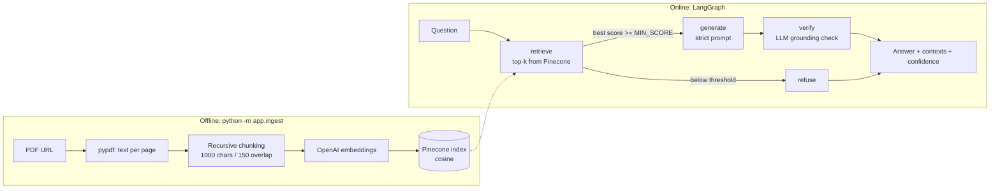

# Agentic AI eBook — RAG Chatbot (LangGraph + Pinecone)

A retrieval-augmented chatbot that answers **only** from the
[Agentic AI eBook](https://konverge.ai/pdf/Ebook-Agentic-AI.pdf). Every response returns the final answer,
the retrieved context chunks (with page and similarity score) and a confidence score.

**Stack:** Python 3.10+, LangGraph, Pinecone (serverless), OpenAI `text-embedding-3-small` + `gpt-4o-mini`,
FastAPI, optional Streamlit UI.

## Architecture



**How answers stay grounded (three layers):**
1. **Retrieval gate** — if the best chunk's cosine score is below `MIN_SCORE`, the graph skips the LLM and refuses.
2. **Constrained generation** — temperature 0, prompt restricts the model to the numbered excerpts and requires
   a fixed refusal sentence when the answer isn't there.
3. **Verification node** — a second LLM pass checks that every claim in the draft is supported by the retrieved
   context; unsupported drafts are replaced with the refusal message (`grounded: false`).

**Confidence score:** the mean raw cosine similarity of the top-3 chunks, linearly rescaled
(0.2 → 0.0, 0.7 → 1.0) and clamped to [0, 1]; halved if the grounding check fails. This is a *heuristic*
retrieval-based confidence, not a calibrated probability. Raw per-chunk scores are also returned so you can
recalibrate for your data.

**Files**

| Path | Purpose |
|------|---------|
| `app/ingest.py` | Download → extract → chunk → embed → upsert |
| `app/rag_graph.py` | LangGraph pipeline (retrieve / generate / verify / refuse) |
| `app/api.py` | FastAPI `/chat` and `/health` |
| `ui.py` | Optional Streamlit chat UI |
| `scripts/run_samples.py` | Runs the sample queries and saves outputs |

## Setup

```bash
git clone <your-repo-url> && cd agentic-ai-rag-chatbot
python -m venv .venv && source .venv/bin/activate      # Windows: .venv\Scripts\activate
pip install -r requirements.txt
cp .env.example .env                                     # then fill in OPENAI_API_KEY and PINECONE_API_KEY
```

### 1. Ingest the PDF (once)
```bash
python -m app.ingest            # add --reset to wipe the namespace and re-ingest
```
This creates the Pinecone serverless index `agentic-ai-ebook` (1536-dim, cosine) if it doesn't exist.

### 2. Run the API
```bash
uvicorn app.api:app --reload --port 8000
```
Interactive docs: http://localhost:8000/docs

```bash
curl -s -X POST http://localhost:8000/chat \
  -H "Content-Type: application/json" \
  -d '{"question": "What is Agentic AI?", "top_k": 5}'
```

### 3. (Optional) Streamlit UI
```bash
streamlit run ui.py            # API must be running on :8000 (override with API_URL)
```

## Response format

```json
{
  "answer": "… [1][2]",
  "answered": true,
  "grounded": true,
  "confidence": 0.78,
  "retrieval_score": 0.5891,
  "reason": "All claims are supported by the excerpts.",
  "contexts": [
    {"id": "p3-c0", "page": 3, "score": 0.6123, "text": "…"}
  ]
}
```

For questions outside the eBook: `answered: false` and the answer is
*"I couldn't find that in the Agentic AI eBook, so I can't answer it."*

## Sample queries

See [`docs/sample_queries.md`](docs/sample_queries.md) (5 in-scope + 1 out-of-scope). Generate real outputs with:
```bash
python -m scripts.run_samples      # writes docs/sample_outputs.md
```

## Tuning & swapping components

- **Too many refusals?** Lower `MIN_SCORE` (e.g. 0.2) or raise `TOP_K`. **Too permissive?** Raise `MIN_SCORE`.
- **Different embeddings/LLM:** change `EMBEDDING_MODEL`, `EMBEDDING_DIM` (must match the index; re-ingest with `--reset`)
  and `LLM_MODEL`. Any LangChain chat/embedding class (Azure OpenAI, Ollama, etc.) can replace the ones in `app/rag_graph.py`.
- **Different vector DB:** only `ingest.py` and the `retrieve` node touch Pinecone.

## Using Groq + local embeddings (no OpenAI key)

Groq offers chat models but no embeddings endpoint, so pair it with free local embeddings:

```
python -m pip install -r requirements-groq.txt
```
In `.env`:
```
EMBEDDING_PROVIDER=huggingface
LLM_PROVIDER=groq
GROQ_API_KEY=gsk_...
PINECONE_INDEX=agentic-ai-ebook-384
```
Use a new index name because these embeddings are 384-dimensional (OpenAI's are 1536); ingestion stops with a clear
message if the index dimension doesn't match. Then run `python -m app.ingest` as usual.

## Known limitations

- Chunks are built per page, so a passage spanning a page break is split.
- Image-only/scanned pages yield no text (ingest warns); add OCR if the PDF needs it.
- The verification pass adds one extra LLM call per answered question (latency + cost).
- No conversation memory: each question is answered independently.
